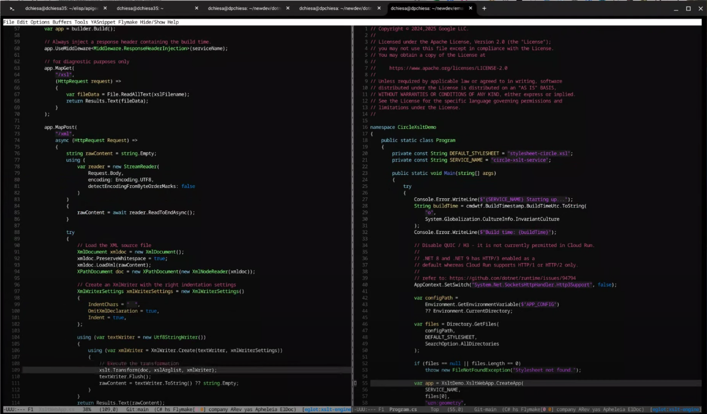

# XSLT Processing using .NET in Google Cloud Run and Application Integration

This is an example of a Cloud Run service. This service implemented in C#, and
runs on .NET 8.0, and exposes a minimal Web API - effectively it is a
microservice. The primary function of this service is to perform XSL Transforms
via [XSLT](https://en.wikipedia.org/wiki/XSLT). It accepts an XML payload on
input over HTTP POST, performs the transform  via [the
XSLCompiledTransform
class](https://learn.microsoft.com/en-us/dotnet/api/system.xml.xsl.xslcompiledtransform?view=net-8.0),
and then sends back a transformed XML document as a response.

You can invoke this service directly via curl, or you can access the service
from within an Integration, running in Google Cloud Integration.

## Disclaimer

This example is not an official Google product, nor is it part of an
official Google product.

## Purpose

Performing XSLT within C# is not rocket science.  A minimal web API is also not
rocket science. Why does this example exist?

The goal is to illustrate the use of a combination of technologies all together.
This example is novel because it combines these elements:
- a .NET minimal Web API
- performing XSLT
- which itself references a separate C# class
- which uses a business rules engine
- built in the cloud by Cloud build
- running as a Cloud Run service in Google Cloud
- invoked by an Integration
- triggered by a file upload to Google Cloud Storage

It covers a lot of ground; I hope it's interesting for people.

## Background

I began exploring this after connecting with several different companies who
observed that they were performing XSLT using a different engine, which was
reaching end-of-life. And they wanted to explore alternatives. At least one of these
companies was using some vendor-specific extensions to XSLT - notably Microsoft's
[msxsl:script](https://learn.microsoft.com/en-us/dotnet/standard/data/xml/script-blocks-using-msxsl-script),
which allows you to embed C# code directly into an XSLT, and invoke it from
within any of the templates. On .NET, that feature is not supported; it
requires the .NET Framework. If you're using the free .NET platform on Linux, you
can't use that feature.

_This example_ illustrates the use of something called an ["Extension
object"](https://learn.microsoft.com/en-us/dotnet/api/system.xml.xsl.xsltargumentlist.addextensionobject?view=net-8.0)
which allows similar capability but without the aspect of co-mingling C# code
and XSLT in one file, as you can do when using `msxsl:script`. To use an
Extension object, you encapsulate your C# code in a separately-compiled
assembly, and then reference the object within the XSLT when the XslCompiledTransform is executed.


## In a Little More Detail

In the [documentation for script blocks](https://learn.microsoft.com/en-us/dotnet/standard/data/xml/script-blocks-using-msxsl-script#calcxsl),
Microsoft offers this example of using `msxsl:script`:

```xml
<xsl:stylesheet version="1.0" xmlns:xsl="http://www.w3.org/1999/XSL/Transform"
  xmlns:msxsl="urn:schemas-microsoft-com:xslt"
  xmlns:user="urn:my-scripts">
  <msxsl:script language="C#" implements-prefix="user">
  <![CDATA[
  public double circumference(double radius){
    double pi = 3.14;
    double circ = pi*radius*2;
    return circ;
  }
  ]]>
  </msxsl:script>
  <xsl:template match="data">
    <circles>
      <xsl:for-each select="circle">
        <circle>
          <xsl:copy-of select="node()"/>
          <circumference>
            <xsl:value-of select="user:circumference(radius)"/>
          </circumference>
        </circle>
      </xsl:for-each>
    </circles>
  </xsl:template>
</xsl:stylesheet>
```

And by applying that transform to the appropriate XML input file, the transform
can invoke the C# code to perform the calculation. Of course the C# code can do
... anything. It's not limited to arithmetic. Once the code gets beyond a few
lines, though, it seems inelegant to co-mingle the C# with the XSL. For
a quick & dirty solution, script blocks will work great. For use within a larger
company or enterprise, you really want to manage distinct parcels of code in
separate files, possibly or probably in separate source code repos.

The Extension Block approach allows that.  With Extension blocks, you can do
something similar. The XSLT is like so:

```xml
<xsl:stylesheet version="2.0" xmlns:xsl="http://www.w3.org/1999/XSL/Transform"
  xmlns:ext="urn:my-extension-object">
  <xsl:template match="data">
    <circles>
      <xsl:for-each select="circle">
        <circle>
          <xsl:copy-of select="node()"/>
          <circumference>
            <xsl:value-of select="ext:Circumference(radius)"/>
          </circumference>
        </circle>
      </xsl:for-each>
    </circles>
  </xsl:template>
</xsl:stylesheet>
```

But in this case, the C# code is managed in an independent module:

```csharp
namespace XsltEngineDemo;

public class ExtObject
{
    public double Circumference(double radius)
    {
        // perform a local calculation.
        double pi = 3.14159;
        double circ = pi * radius * 2;
        return circ;
    }
}
```

And to use that code, you need to refer to an instance of that object when you execute the transform:

```csharp
      XslCompiledTransform xslt = new XslCompiledTransform();
      xslt.Load(xsltFilename, null /* xsltSettings */, new XmlUrlResolver());

      XsltArgumentList xslArglist = new XsltArgumentList();
      ExtObject obj = new ExtObject();
      // register that object at a particular namespace
      xslArglist.AddExtensionObject("urn:my-extension-object", obj);
      ...
          // Execute the transformation
          xslt.Transform(doc, xslArglist, xmlWriter);
```      

This repo shows a a few different options for demonstrating variations on this idea.
And then extends that by running the services in Google Cloud - Cloud Run is so easy!
And then extends _that_ idea by invoking those services from an Integration.

## Screencast Walkthrough

Here is a 30-minute [screencast walkthrough](https://www.youtube.com/watch?v=3JLp1_6CTDU) of
this sample. (I recommend watching it at 1.5x speed if your ears are fast.)

[](https://www.youtube.com/watch?v=3JLp1_6CTDU)


## Demonstrations included here

There are three distinct demonstrations included here, of XSLT that call out to
an extension object defined in C#:

- [circle](./circle) - an object that performs a calculation of a
  Circle's circumference, and returns a simple result - a double - that can
  be embedded directly into the XSL output.
  
- [claims-simple](./claims-simple) - an extension object that checks through a
  medical claim and performs some analysis of it. It returns an XML NodeSet,
  which is embedded into the output of the XSL.
   
- [claims-with-rules](./claims-with-rules) - an extension object that uses a
  Business Rules engine to process a medical claim. As above, it returns an XML
  NodeSet, which is embedded into the output of the XSL.


## Pre-requisites

- for development, a Linux workstation
- a bash shell
- [dotnet 8.0](https://dotnet.microsoft.com/en-us/download/dotnet/8.0)
- [the gcloud cli](https://cloud.google.com/sdk/docs/install-sdk)


## Building the demonstrations (locally)

Open a terminal window on your workstation, and `cd` to the directory containing
the content from this repo.

To locally build each of [circle](./circle), [claims-simple](./claims-simple), and
[claims-with-rules](./claims-with-rules), cd into the appropriate directory and
execute `dotnet build`. For example:

```sh
cd circle
dotnet build
```

This will build one particular service.

To run one service, execute `dotnet run` from within the same directory:
```sh
dotnet run
```

Each service listens by default on localhost:9090.  Because they all use the
same port, you can run just one of these services at a time on your local
workstation.

## Sending sample requests into the service running locally

You can use the curl command to send a request any of the services.
_Open a new terminal_ and use this:

```sh
cd circle
ENDPOINT=0:9090
data_files=(./sampledata/*.xml)
selected_file="${data_files[$((RANDOM % ${#data_files[@]}))]}"
curl -i -X POST -H content-type:application/xml \
  ${ENDPOINT}/xml \
  --data-binary @"${selected_file}"
```

The `ENDPOINT` should be `0:9090` to connect with the service running locally. 

The file you send can be one of the XML files in the sampledata directory in
each of the subdirectories.

There's a [sendOne.sh](./sendOne.sh) script that can help you; it selects a
random file and prints it out, before sending it to the service with a curl
command. It then prints the response.

To use it:
```sh
TARGET=local ./sendOne.sh
```

You will see output like the following:
```
TARGET=local
Selected file ./sampledata/claim2.xml

input:
<claims>
  <claim>
    <procedureCode>142007</procedureCode>
    <patientId>ABC-123</patientId>
    <amount>287.05</amount>
  </claim>
</claims>

sending to target: 0:9090

output:
HTTP/1.1 200 OK
Content-Length: 237
Content-Type: text/plain; charset=utf-8
Date: Wed, 05 Mar 2025 21:58:38 GMT
Server: Kestrel
Build-Time: 2025-03-05T21:02:53.3949997Z
service: claims-xslt-service-with-rules xx

<claims>
  <claim>
    <id>21</id>
    <amount>287.05</amount>
    <procedureCode>142007</procedureCode>
    <patientId>ABC-123</patientId>
    <isApproved>true</isApproved>
    <note>approved (with surcharge)</note>
  </claim>
</claims>
```

The input shows a sample claim in XML format sent to the claims-simple service. The response shows that the claim
was approved with a surcharge.

## Deploying to Cloud Run

You can also deploy any or all of the examples to Google Cloud Run in your GCP
Project.

To do so, first open a text editor and modify the settings in the env.sh file.
The settings are:
```sh
export PROJECT=my-gcp-project
export REGION=us-west1
export EMAIL_ADDR=email@example.org

export SERVICE_ROOT=xslt-svc
export APPCONFIG_BUCKET=xslt-svc-config
export UPLOAD_BUCKET=xml-drop-zone
export PUBSUB_TOPIC=xml-input
```

You will want to set the `PROJECT`,
`REGION`, and `EMAIL_ADDR` to something appropriate for you.
You may wish to leave the other things as 
they are.


Once you have modified that file, open a terminal, and _source_ it, then run the
build-and-deploy script:

```sh
source ./env.sh
./build-and-deploy-service.sh circle
```

To deploy all three:

```sh
source ./env.sh
./build-and-deploy-service.sh circle
./build-and-deploy-service.sh claims-simple
./build-and-deploy-service.sh claims-with-rules
```

The script does some housekeeping - creates a service account, assigns
roles to it, creates a Cloud Storage bucket, copies files into the bucket, and
so on... And then, finally, it runs `gcloud run deploy` to deploy the .NET
XSLT service, from source code, into Cloud Run.

When you "deploy from source" , the gcloud tool zips up the source code from the local
directory and sends it to Google cloud, where it is built, _in the cloud_.
This happens via Cloud Build.  Cloud Build is an independent, general purpose build
service, but there is "magic integration" between Cloud Run and Cloud Build, such that
if you deploy from source code, Cloud Build does the build for you.  This is described
in detail [here](https://cloud.google.com/run/docs/deploying-source-code).

> You have the option of building a docker image "manually", and deploying that
  to Cloud Run. That would give you  more control over the build process.

This all takes a few minutes.

> By The Way, don't try to run multiple invocations of `build-and-deploy-service.sh`
  at once; the script checks for and creates common shared resources and that logic
  wasn't designed to handle race conditions.

To invoke any of the services running in Cloud Run, use the `sendOne.sh` script. It
sends a randomly selected input data payload:

```sh
./sendOne.sh circle
./sendOne.sh claims-simple
./sendOne.sh claims-with-rules
```

In all cases you should see a happy message back from the remote
service. Something like the following:

```
output:
HTTP/2 200
content-type: text/plain; charset=utf-8
build-time: 2025-03-06T03:06:40.5450124Z
service: claims-xslt-service xslt-svc-claims-simple-00003-dkn
x-cloud-trace-context: ade35adcad9136fafb6387f01c894dda;o=1
date: Thu, 06 Mar 2025 03:37:01 GMT
server: Google Frontend
content-length: 192

<claims>
  <claim>
    <id>1</id>
    <amount>190.5</amount>
    <procedureCode>142007</procedureCode>
    <patientId>ABC-123</patientId>
    <isApproved>true</isApproved>
  </claim>
</claims>
```

### Using Curl to invoke the remote service

You can also use the curl command to send a request any of the services running remotely.
Within a terminal you need to inquire the URI for the service, then use that
URI.  For example, for the circle service:

```sh
SERVICE="${SERVICE_ROOT}-circle"
ENDPOINT=$(gcloud run services describe "${SERVICE}" --region "${REGION}" --project="${PROJECT}" --format 'value(status.url)')
data_files=(./circle/*.xml)
selected_file="${data_files[$((RANDOM % ${#data_files[@]}))]}"
curl -i -X POST -H content-type:application/xml \
  ${ENDPOINT}/xml \
  --data-binary @"${selected_file}"
```


## Invoking the services from Application Integration

It's handy to be able to stitch together a variety of services into a single,
coherent sequence.  Google Cloud [Application
Integration](https://cloud.google.com/application-integration/docs/overview) is
a purpose-build integration platform as a service that fills that purpose.

ONE of the things it can do is invoke REST services, as part of an integration
or flow. For example, a simple integration might receive an XML file, perhaps a
Claims file, after it's been dropped into a Google Cloud Storage bucket via SFTP
transfer.  The integration might validate the file, then invoke the XSLT
service, then drop the resulting transformed file into another bucket, or send
it along to another service.

This flow might look like this:


Included here in this repo is a script to set up an Integration that

- listens for files being dropped into Google Cloud Storage - this might happen
  as the result of an SFTP upload.

- reads the file, and inspects its content

- sends the XML file to one of a set of different XSLT services depending on the content

- sends a email with the result of the transform.

To set this up, again make sure the settings in your env.sh file are correct,
then:

- check and maybe create the GCS connector
  ```sh
  source ./env.sh
  ./check-and-maybe-create-gcs-connector.sh
  ```
  If that script creates a new connector, you will have to wait a bit for it to
  finish.

- Create the integration
  ```sh
  ./setup-xml-handler-integration.sh
  ```

  That will take a few minutes to run.

- To send one file after that completes, use the upload script:
  ```sh
  ./upload-one.sh
  ```

  That will select a random XML file and drop it into the GCS upload bucket.
  You should see an email at the email address you configured in your env.sh file.

  In my case it looks like this:
  

## Teardown and cleanup

- If you set up the integration, you can remove it by running the teardown script:
  ```sh
  ./teardown-xml-handler-integration.sh
  ```
  This will remove the Integration, and the GCS upload bucket, and the PubSub
  topic associated to it.

- If you want to remove the Cloud Run service and the
  service account associated to that, then you need to run the cleanup script:
  ```sh
  ./clean-gcp-artifacts.sh
  ```


## Support

This callout is open-source software, and is not a supported part of the Google
Cloud Platform.  If you need assistance, you can try inquiring on [the Google
Cloud Community forum dedicated to Application
Integration](https://goo.gle/appint-community) There is no service-level
guarantee for responses to inquiries posted to that site.

## License

The material is [Copyright 2024-2025 Google LLC](./NOTICE).
and is licensed under the [Apache 2.0 License](LICENSE). This includes the C#
code as well as the all of the automation scripts.


## Bugs

0. This README does not provide a description of the manual steps needed
   to deploy these examples, including: creating service accounts, setting roles,
   creating buckets, creating pubsub notifications on buckets, creating connectors,
   and so on.  If  you've read this far, and you REALLY want that, let me know.
   Today the workaorund is: read the scripts! 

1. The `gcloud run deploy` command, within the
   [build-and-deploy-service.sh](./build-and-deploy-service.sh) script, by design,
   allows all unauthenticated access to the service, after it is built. In some cases,
   if you have "Domain Restricted sharing" enabled on your GCP Project, the deployment
   will succeed, but the subsequent modification of the access rights will fail.

   There are some workarounds:

   a. Disable Domain Restricted Sharing
      ([how-to](https://thefridaydeploy.substack.com/p/how-to-fix-domain-restricted-sharing)).
      This may or may not be acceptable or advisable. Proceed with care.
      
   b. Send an Identity token with each request to the Cloud Run services.
      To set that up you must use something like:
      ```sh
      gcloud run services add-iam-policy-binding SERVICE_NAME \
          --member="user:USER_EMAIL" --role='roles/run.invoker' \
          --region "${REGION}"--project "$PROJECT"
      ```
      
      Where `SERVICE_NAME` is one of: {xslt-svc-circle, xslt-svc-claims-simple,
      xslt-svc-claims-with-rules }. This allows a specific user to invoke the
      cloud run service. You then need to invoke the service with an identity
      token in the Authorization header:
      
      ```sh
      curl -i -X POST -H content-type:application/xml \
        -H "Authorization: Bearer $(gcloud auth print-identity-token)" \
        ${ENDPOINT}/xml \
        --data-binary @"${randomfile}"
      ```

2. When deploying to cloud run, the deployment script copies the appsettings.json file
   for each service to the APPCONFIG bucket. This overwrites any previous copy of that
   file. Coincidentally the appsettings.json is identical among the three services
   but if any of them should need a different file, there will be contention. The fix
   is to use unique filenames for app settings. This requires some custom startup code
   in the services. I decided that wasn't important, for now.
